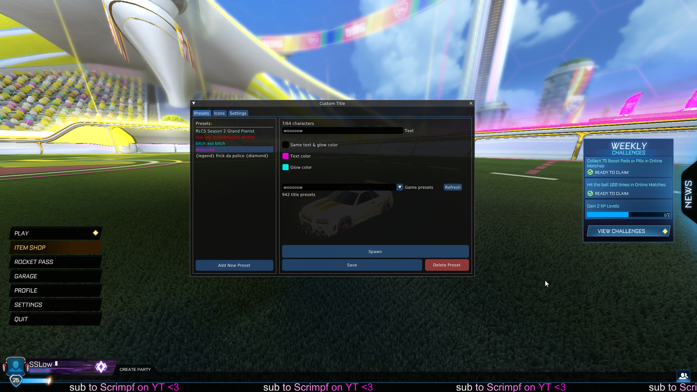
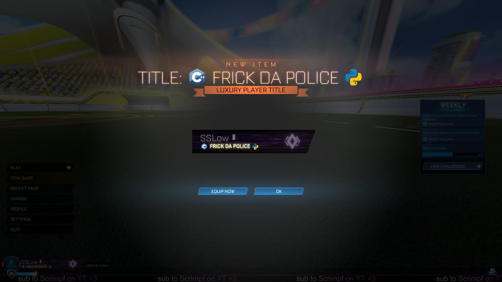

# Custom Title (BakkesMod plugin)
Enables client-side title customization (and more) in Rocket League





## ✨ Features
- Edit text, text color & glow color
- Edit tournament rank icons using custom images
- Create title presets to save your designs
- Apply the appearance of any existing RL title
- Spawn your custom title
  - Can also spawn any item based on its product ID
- Display your custom title to other players with the mod (optional)
- Censor the titles of other players with the mod (optional)

## 🔧 Installation
Download the latest release from the [Releases page](https://github.com/smallest-cock/CustomTitle/releases).

## 💻 Console Commands
You can use the following commands in the BakkesMod console (`F6`) or bind them to keys:

| Command | Description | Best Used With |
|--------|-------------|----------------|
| `customtitle_spawn_custom_title` | Spawn current title preset | Key bind |
| `customtitle_spawn_item <id>` | Spawn item based on its product ID | Console |

## 🛠️ Building
To build the project, follow these steps:

### 1. Initialize Submodules
Run `init-submodules.bat` (or `init-submodules.sh` for bash) after cloning the repo to initialize the submodules in an optimal way

<details> <summary>🔍 Why this instead of <code>git submodule update --init --recursive</code> ?</summary>
<li>Avoids downloading 200MB of history for the <strong>nlohmann/json</strong> library</li>
<li>Allows Git to detect updates for the other submodules</li>
</details>

---

### 2. Install Dependencies via vcpkg
This project uses [DirectXTex](https://github.com/microsoft/DirectXTex) and [MinHook](https://github.com/TsudaKageyu/minhook) which are installed via vcpkg

**Install vcpkg** (if you dont already have it):
```bash
# Clone vcpkg (minimal download)
git clone https://github.com/microsoft/vcpkg.git --depth 1
cd vcpkg

# Initialize submodules (minimal download)
git submodule update --init --recursive --depth 1

# Bootstrap vcpkg and enable MSBuild integration
./bootstrap-vcpkg.bat
./vcpkg integrate install
```

➡️ Now when you build the project for the first time, vcpkg will build/install the dependencies listed in `vcpkg.json`.

More info: [vcpkg manifest mode](https://learn.microsoft.com/en-us/vcpkg/consume/manifest-mode?tabs=msbuild%2Cbuild-MSBuild#2---integrate-vcpkg-with-your-build-system)

## ❤️ Support
If you found this plugin helpful and want to support future development:

[](https://ko-fi.com/sslowdev)